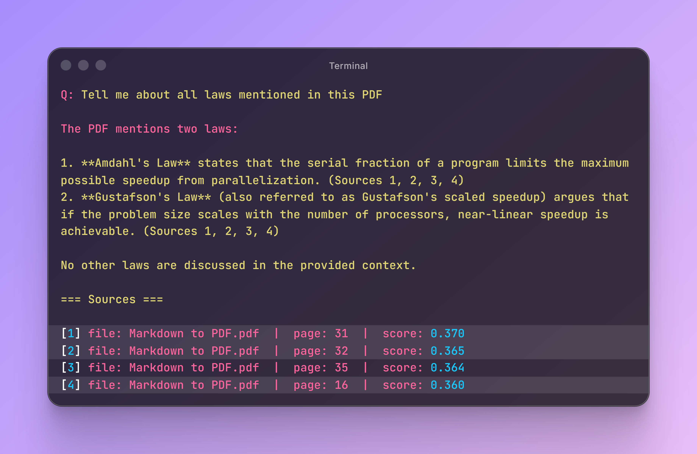

# RagForge API

Production-grade document Q&A API. Upload PDFs → get accurate answers with source citations. Full streaming, multi-turn conversation memory.

## Quick Start

1. Make sure you have [Docker](https://docs.docker.com/get-docker/) and [Docker Compose](https://docs.docker.com/compose/install/) installed.

2. Configure environment:

```
cp .env.example .env
```

3. Fill in your API keys in `.env`:

```
DEEPSEEK_API_KEY=your-deepseek-key
OPENAI_API_KEY=your-openai-key
```

4. Start the services:

```
docker compose up --build
```

5. Upload a PDF:

```
curl -X POST http://localhost:8000/upload \
  -F "file=@document.pdf"
```

6. Ask a question with streaming:

```
curl -N -X POST http://localhost:8000/query \
  -H "Content-Type: application/json" \
  -d '{"question": "What is the refund policy?", "conversation_id": "session-1"}'
```

7. Visit [http://localhost:8000/docs](http://localhost:8000/docs) - That's it! 🎉

## Demo



## Tech Stack

- **FastAPI** - Modern, fast web framework for building APIs
- **LlamaIndex** - RAG framework for document indexing and retrieval
- **Qdrant** - Vector database for semantic search
- **Docker** - Containerization and deployment

## Key Features

- 📄 **PDF ingestion pipeline**: Upload any PDF — automatic text extraction, chunking (1024 tokens, 20 overlap), and embedding via OpenAI `text-embedding-3-small` (1536-dim).
- 🔍 **Semantic retrieval + LLM synthesis**: Top-K vector search in Qdrant, then DeepSeek V4 Flash synthesizes a grounded answer with source citations (page number, file name, relevance score).
- 💬 **Multi-turn conversation memory**: `ContextChatEngine` with `ChatMemoryBuffer` retains conversation history across turns — ask follow-up questions without re-explaining context.
- 📡 **Streaming via Server-Sent Events**: Token-by-token streaming using `sse-starlette` with proper `text/event-stream` headers, `Cache-Control: no-cache`, `X-Accel-Buffering: no`, and keep-alive pings.
- 🗄️ **Qdrant self-hosted**: Qdrant v1.17.1 (Gridstore engine) running alongside the API in Docker Compose with persistent volumes and health checks.
- ⚡ **DeepSeek V4 Flash**: 284B total / 13B active params, 1M context window, $0.09/M input tokens. OpenAI-compatible API — no SDK lock-in.
- 🐳 **One-command deploy**: `docker compose up --build` brings up Qdrant + FastAPI together with proper service dependencies and health checks.
- 🔧 **Configurable via environment**: Chunk size, overlap, top-K, collection name, model selection, token expiry — all driven by `.env`.
- 🧹 **Conversation reset**: Clear conversation memory on demand with `POST /conversation/reset?conversation_id=...`.

## Configuration

All settings are env-driven via `.env`:

| Variable | Default | Description |
|---|---|---|
| `DEEPSEEK_API_KEY` | — | DeepSeek API key |
| `DEEPSEEK_MODEL` | `deepseek-v4-flash` | LLM model |
| `OPENAI_API_KEY` | — | OpenAI API key (embeddings) |
| `EMBEDDING_MODEL` | `text-embedding-3-small` | Embedding model |
| `EMBEDDING_DIM` | `1536` | Embedding dimensions |
| `QDRANT_URL` | `http://qdrant:6333` | Qdrant endpoint |
| `QDRANT_COLLECTION` | `ragforge_docs` | Qdrant collection name |
| `QDRANT_API_KEY` | — | Qdrant API key |
| `CHUNK_SIZE` | `1024` | Chunk size in tokens |
| `CHUNK_OVERLAP` | `20` | Chunk overlap |
| `SIMILARITY_TOP_K` | `4` | Top-K retrieval count |

## License

MIT
